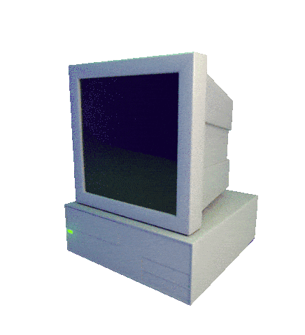

## Olá, Daniel aqui!

    

    
    <h1 align="center">Linguagens de programação e  Tecnologias</h1>
    
    
    
    
    
      
  
    
     
     
    
    
   

   
    
   
  <h1 align="center">Redes Sociais</h1>
    
    
    
  

  

